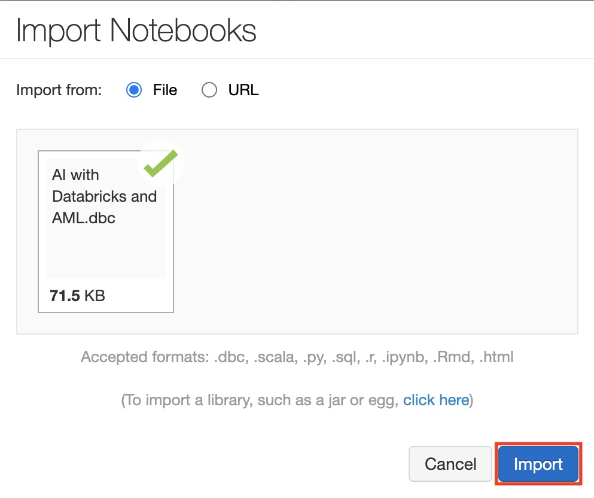

# Machine Learning before the hands-on lab setup guide

## Before the hands-on lab

### Task 1: Create your Azure Databricks Account

Azure Databricks is an Apache Spark-based analytics platform optimized for Azure that supports data engineering and machine learning and deep learning workloads.

1. In the [Azure Portal](https://portal.azure.com), select **+ Create a resource**, then type "Azure Databricks" into the search bar. Select Azure Databricks from the results.

    

2. Select **Create**.

    

3. Set the following configuration on the Azure Databricks Service creation form:

    - **Workspace name**: Enter a unique name, this will be indicated by a green check mark.

    - **Subscription**: Select the subscription you are using for this hands-on lab.

    - **Resource Group**: Select **Create new** and provide the name `MCW-Machine-Learning`.

    - **Location**: Select a region close to you. ***(If you are using an Azure Pass, select South Central US.)***

    - **Pricing**: Select **Premium (+ Role-based access controls)**.

    

4. Select **Review + Create** and then select **Create** when the form values passes validation.

### Task 2: Create an Azure Databricks cluster

You have provisioned an Azure Databricks workspace, and now you need to create a new cluster within the workspace.

1. From within Azure portal navigate to your resource group name (e.g., `MCW-Machine-Learning`).

2. Next, select your Azure Databricks service from the list.

    

3. In the Overview pane of the Azure Databricks service, select **Launch Workspace**.

    

    Azure Databricks will automatically log you in using Azure Active Directory Single Sign On.

    

4. Select **Clusters** (1) from the menu, then select **Create Cluster** (2).

    

5. On the Create New Cluster form, provide the following:

    - **Cluster Name**: `lab`

    - **Cluster Mode**: **Standard**

    - **Databricks Runtime Version**: **Runtime: 7.3 LTS (Scala 2.12, Spark 3.0.1)**

    - **Enable autoscaling**: **Uncheck** this option.

    - **Terminate after ___ minutes of inactivity**: Leave **checked** and in the text box enter `120`.

    - **Worker Type**: **Standard_DS3_v2**

    - **Workers**: `1`

    - **Driver Type**: **Same as worker**

   

6. Select **Create Cluster**. It will take few minutes to create the cluster. Please ensure that the cluster state is running before proceeding further.

### Task 3: Install libraries on the Azure Databricks Cluster

The notebooks you will run depends on certain Python libraries that will need to be installed in your cluster. The following steps walk you through adding these dependencies.

1. From the left-hand menu in your Workspace, select **Clusters**.

    

2. In the list of clusters, select your cluster. Make sure the state of the cluster is `Running`.

    

3. Select the **Libraries** link and then select **Install New**.

    

4. In the Library Source, select **PyPi** and in the Package text box type `azureml-sdk[databricks]` and select **Install**.

    

5. An entry for azureml-sdk will appear in the list. The install will progress first with a status of installing followed by the status of installed.

### Task 4: Upload the Databricks notebook archive

1. Select the link below to download the `Databricks notebook archive` file to your local computer:

   [AI with Databricks and AML.dbc](https://github.com/microsoft/MCW-Machine-Learning/blob/master/Hands-on%20lab/notebooks/AI%20with%20Databricks%20and%20AML.dbc?raw=true)

2. Within the Azure Databricks Workspace, using the command bar on the left, select **Workspace**, **Users** and select your username (the entry with house icon).

3. In the blade that appears, select the downwards pointing chevron next to your name, and select **Import**.

    

4. On the Import Notebooks dialog, browse and open the `AI with Databricks and AML.dbc` file from your local computer and then select **Import**.

    

5. A folder named after the archive should appear. Select that folder.

6. The folder will contain one or more notebooks. These are the notebooks you will use in completing this lab.

### Task 5: Create your Azure Machine Learning Workspace

1. In the [Azure Portal](https://portal.azure.com), select **+ Create a resource**, then type `Machine Learning` into the search bar.

    

2. Select **Create**.

    

3. In the Create Machine Learning Workspace dialog that appears, provide the following values:

    - **Subscription**: Choose your Azure subscription.

    - **Resource group**: Select the resource group in which you deployed your Azure Databricks workspace.

    - **Workspace Name**: `mcwmachinelearning`

    - **Region**: Choose a region closest to you (it is OK if the Azure Databricks Workspace and the Azure Machine Learning Workspace are in different locations).

    

4. Select **Review + Create** and then select **Create** when the form values passes validation.

You should follow all these steps provided _before_ attending the Hands-on lab.
