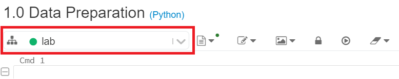
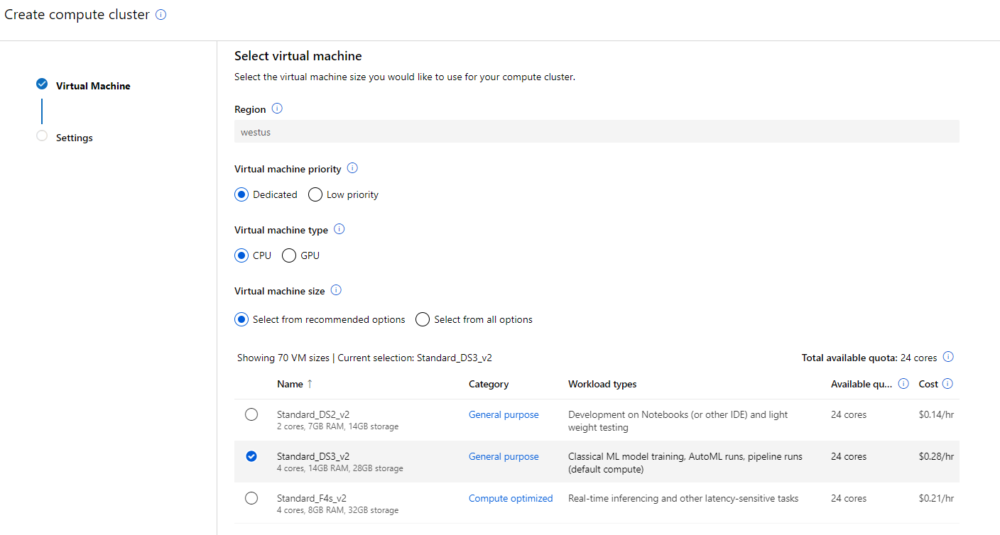
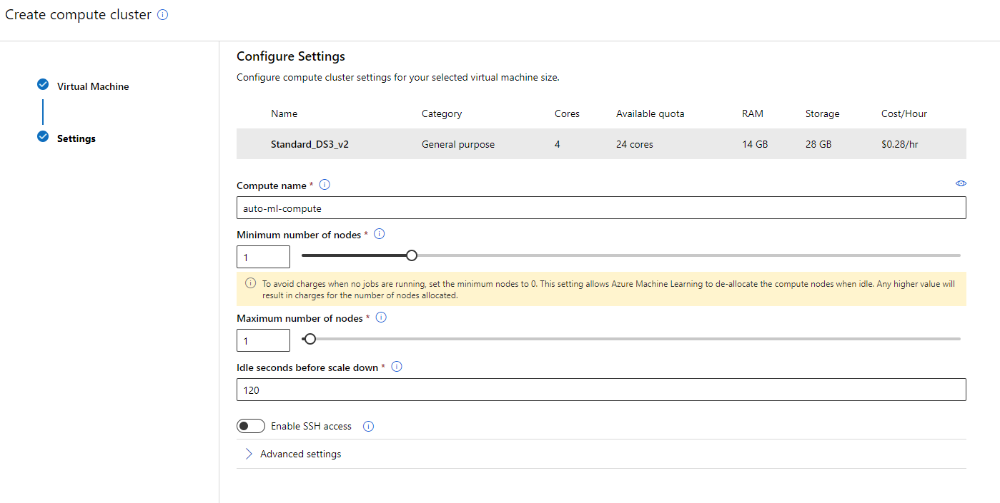

# Machine Learning hands-on lab step-by-step

## Solution architecture

The following diagram summarizes the key components and processing steps in the lab.

## Exercise 1: Data exploration and preprocessing

### Task 1: Load, explore and prepare the dataset using an Azure Databricks notebook

1. Browse to your Azure Databricks Workspace and navigate to `AI with Databricks and AML \ 1.0 Data Preparation`. This is the notebook you will step through executing in this exercise.

2. When you execute a notebook, you will need to attach it to a cluster. You can specify that the **lab** cluster should be used in the upper left-hand corner of the notebook. 

    

3. Follow the instructions within the notebook to complete the exercise. Press Shift+Enter to execute a cell.

## Exercise 2: Creating a forecast model using automated machine learning

### Task 1: Create an automated machine learning experiment

1. Navigate to your Azure Machine Learning workspace in the Azure Portal. Select **Try the new Azure Machine Learning studio, Launch now**.

    

    > **Note**: Alternatively, you can sign-in directly to the [Azure Machine Learning studio portal](https://ml.azure.com).

2. Select **Automated ML icon** in the left navigation bar.

    

3. Select **+ New automated ML run**.

    

4. Select the `daily-battery-time-series` dataset from the list of registered datasets and then select **Next**. (This dataset was registered as a final step of the previous exercise, from the Azure Databricks notebook.)

     

5. Review the dataset details in the `Configure run` section, by selecting the **View dataset** link next to the dataset name.

    

6. In the `Dataset preview` dialog select **Close** and return to the `Configure run` dialog.

    

7. Provide the experiment name: `Battery-Cycles-Forecast` and select **Daily_Cycles_Used** as target column. Select **Create a new compute**.

    

8. For the new compute, provide the following values and then select **Next**:

    - **Virtual machine priority**: `Dedicated`

    - **Virtual machine type**: `CPU`

    - **Virtual machine size**: `Select from recommended options` --> `Standard_DS3_v2`

    

9. On the next page, provide the following parameters for your compute cluster. Then, select **Create**.

    - **Compute name**: `auto-ml-compute`

    - **Minimum number of nodes**: `1`

    - **Maximum number of nodes**: `1`

    - **Idle seconds before scale down**: `120`

    

    > **Note**: The creation of the new compute may take several minutes. Once the process is completed, select **Next** in the `Configure run` section.

10.  Select the `Time series forecasting` task type and provide the following values and then select **View additional configuration settings**:

    - **Time column**: `Date`

    - **Time series identifier(s)**: `Battery_ID`

    - **Forecast horizon**: `30`

    

11. For the automated machine learning run additional configurations, provide the following values and then select **Save**:

    - **Primary metric**: `Normalized root mean squared error`

    - **Explain best model**: Selected

    - **Training job time (hours)** (in the `Exit criterion` section): enter `1` as this is the lowest value currently accepted.

    - **Metric score threshold**: enter `0.1355`. When this threshold value will be reached for an iteration metric the training job will terminate.

    

    > **Note**: We are setting a metric score threshold to limit the training time. In practice, for initial experiments, you will typically only set the training job time to allow AutoML to discover the best algorithm to use for your specific data.

12. Select **Finish** to start the new automated machine learning run.

    > **Note**: The experiment should run for up to 10 minutes. If the run time exceeds 15 minutes, cancel the run and start a new one (steps 3, 9, 10). Make sure you provide a higher value for `Metric score threshold` in step 10.

### Task 2: Review the experiment run results

1. Once the experiment completes, select `Details` to examine the details of the run containing information about the best model and the run summary.

   

2. Select `Models` to see a table view of different iterations and the `Normalized root mean squared error` score for each iteration. Note that the normalized root mean square error measures the error between the predicted value and actual value. In this case, the model with the lowest normalized root mean square error is the best model. Note that Azure Machine Learning Python SDK updates over time and gives you the best performing model at the time you run the experiment. Thus, it is possible that the best model you observe can be different than the one shown below.

    

3. Return to the details of your experiment run and select the best model **Algorithm name**.

    

4. From the `Model` tab, select **View all other metrics** to review the various `Run Metrics` to evaluate the model performance.

    

5. Next, select **Metrics, predicted_true** to review the model performance curve: `Predicted vs True`.

    

    > **Note**: You may need to deselect the other metrics.

### Task 3: Deploy the Best Model

1. From the top toolbar select **Deploy**.

    

2. Provide the `Name`, `Description` and `Compute type`, and then select **Deploy**:

    - **Name**: **battery-cycles**

    - **Description**: **The best AutoML model to predict battery cycles.**

    - **Compute type**: Select `ACI`.

    

3. The model deployment process will register the model, create the deployment image, and deploy it as a scoring webservice in an Azure Container Instance (ACI). To view the deployed model, from Azure Machine Learning studio select **Endpoints icon, Real-time endpoints**.

   

   > **Note**: The `battery-cycles` endpoint will show up in a matter of seconds, but the actual deployment takes several minutes. You can check the deployment state of the endpoint by selecting it and then selecting the `Details` tab. A successful deployment will have a state of `Healthy`.

4. If you see your model deployed in the above list, you are now ready to continue on to the next exercise.
   
### Task 4: Perform batch scoring in Azure DataBricks

1. Browse to your Azure Databricks Workspace and navigate to `AI with Databricks and AML \ 2.0 Batch Scoring for Timeseries`. This is the notebook you will step through executing in this exercise. Again, remember that you may need to reconnect to the **lab** cluster.

2. Follow the instructions within the notebook to complete the exercise.

## Exercise 3: Creating a deep learning model (RNN) for time series data

### Task 1: Create the deep learning model and start a streaming job using a notebook

1. Browse to your Azure Databricks Workspace and navigate to `AI with Databricks and AML \ 3.0 Deep Learning with Time Series`. This is the notebook you will step through executing in this exercise.

2. Follow the instructions within the notebook to complete the exercise.

## After the hands-on lab

### Task 1: Clean up lab resources

1. Navigate to the Azure Portal and locate the `MCW-Machine-Learning` Resource Group you created for this lab.

2. Select **Delete resource group** from the command bar.

    

3. In the confirmation dialog that appears, enter the name of the resource group and select **Delete**.

4. Wait for the confirmation that the Resource Group has been successfully deleted. If you don't wait, and the delete fails for some reason, you may be left with resources running that were not expected. You can monitor using the Notifications dialog, which is accessible from the Alarm icon.

    

5. When the Notification indicates success, the cleanup is complete.

    

