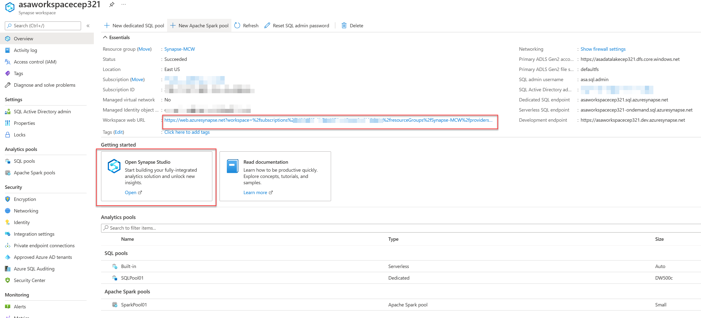

# Azure Synapse Analytics and AI hands-on lab step-by-step

## Architecture

## Resource naming throughout this lab

For the remainder of this lab, the following terms will be used for various ASA (Azure Synapse Analytics) related resources (make sure you replace them with actual names and values from your environment):

| Azure Synapse Analytics Resource  | To be referred to                                                                  |
|-----------------------------------|------------------------------------------------------------------------------------|
| Azure Subscription                | `WorkspaceSubscription`                                                            |
| Azure Region                      | `WorkspaceRegion`                                                                  |
| Workspace resource group          | `WorkspaceResourceGroup`                                                           |
| Workspace / workspace name        | `asaworkspace{suffix}`                                                             |
| Primary Storage Account           | `asadatalake{suffix}`                                                              |
| Default file system container     | `DefaultFileSystem`                                                                |
| SQL Pool                          | `SqlPool01`                                                                        |
| SQL Serverless Endpoint           | `SqlServerless01`                                                                  |
| Azure Key Vault                   | `asakeyvault{suffix}`                                                              |

## Exercise 1: Accessing the Azure Synapse Analytics workspace

### Task 1: Launching Synapse Studio

1. Log into the [Azure Portal](https://portal.azure.com).

2. Expand the left menu, and select the **Resource groups** item.
  
    

3. From the list of resource groups, select `WorkspaceResourceGroup`.
  
4. From the list of resources, select the **Synapse Workspace** resource, `asaworkspace{suffix}`.
  
    

5. On the **Overview** tab of the Synapse Workspace page, select the **Open Synapse Studio** card from beneath the **Getting Started** heading. Alternatively, you can select the Workspace web URL link.

    

