# Azure Synapse Analytics and AI hands-on lab step-by-step


## Exercise 2: Create and populate the supporting tables in the SQL Pool


### Task 1: Create the sale table

Over the past 5 years, Wide World Importers has amassed over 3 billion rows of sales data. With this quantity of data, the storage consumed would be greater than 2 GB. While we will be using only a subset of this data for the lab, we will design the table for the production environment. Using the guidance outlined in the current Exercise description, we can ascertain that we will need a **Clustered Columnstore** table with a **Hash** table distribution based on the **CustomerId** field which will be used in most queries. For further performance gains, the table will be partitioned by transaction date to ensure queries that include dates or date arithmetic are returned in a favorable amount of time.

1. Expand the left menu and select the **Develop** item. From the **Develop** blade, expand the **+** button and select the **SQL script** item.

    

2. In the query tab toolbar menu, ensure you connect to your SQL Pool, `SQLPool01`.

    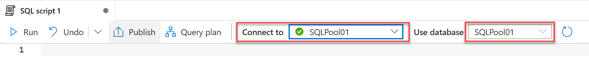

3. In the query window, copy and paste the following query to create the customer information table. Then select the **Run** button in the query tab toolbar.

    ```sql
      CREATE TABLE [wwi_mcw].[SaleSmall]
      (
        [TransactionId] [uniqueidentifier]  NOT NULL,
        [CustomerId] [int]  NOT NULL,
        [ProductId] [smallint]  NOT NULL,
        [Quantity] [tinyint]  NOT NULL,
        [Price] [decimal](9,2)  NOT NULL,
        [TotalAmount] [decimal](9,2)  NOT NULL,
        [TransactionDateId] [int]  NOT NULL,
        [ProfitAmount] [decimal](9,2)  NOT NULL,
        [Hour] [tinyint]  NOT NULL,
        [Minute] [tinyint]  NOT NULL,
        [StoreId] [smallint]  NOT NULL
      )
      WITH
      (
        DISTRIBUTION = HASH ( [CustomerId] ),
        CLUSTERED COLUMNSTORE INDEX,
        PARTITION
        (
          [TransactionDateId] RANGE RIGHT FOR VALUES (
            20180101, 20180201, 20180301, 20180401, 20180501, 20180601, 20180701, 20180801, 20180901, 20181001, 20181101, 20181201,
            20190101, 20190201, 20190301, 20190401, 20190501, 20190601, 20190701, 20190801, 20190901, 20191001, 20191101, 20191201)
        )
      );
    ```

4. At the far right of the top toolbar, select the **Discard all** button as we will not be saving this query. When prompted, choose to **Discard changes**.

   

### Task 2: Populate the sale table

>&#x1F534; **Note**: This task involves a long data loading activity (approximately 45 minutes in duration). Once you have triggered the pipeline, please continue to the next task.

The data that we will be retrieving to populate the sale table is currently stored as a series of parquet files in the **asadatalake{SUFFIX}** data lake (Azure Data Lake Storage Gen 2). This storage account has already been added as a linked service in Azure Synapse Analytics when the environment was provisioned. Linked Services are synonymous with connection strings in Azure Synapse Analytics. Azure Synapse Analytics linked services provides the ability to connect to nearly 100 different types of external services ranging from Azure Storage Accounts to Amazon S3 and more.

1. Review the presence of the **asadatalake{SUFFIX}** linked service, by selecting **Manage** from the left menu, and selecting **Linked services** from the blade menu. Filter the linked services by the term **asadatalake** to find the **asadatalake{SUFFIX}** item. Further investigating this item will unveil that it makes a connection to the storage account using a storage account key.
  
   

2. The sale data for each day is stored in a separate parquet file which is placed in storage following a known convention. In this lab, we are interested in populating the Sale table with only 2018 and 2019 data. Investigate the structure of the data by selecting the **Data** tab, and in the **Data** pane, select the **Linked** tab, expanding the **Azure Data Lake Storage Gen 2** item, and expanding the `asadatalake{SUFFIX}` Storage account.

    > **Note**: The current folder structure for daily sales data is as follows: 
    /wwi-02/sale-small/Year=`YYYY`/Quarter=`Q#`/Month=`M`/Day=`YYYYMMDD`, where `YYYY` is the 4-digit year (e.g., 2019), `Q#` represents the quarter (e.g., Q1), `M` represents the numerical month (e.g., 1 for January) and finally `YYYYMMDD` represents a numeric date format representation (e.g., `20190516` for May 16, 2019).
    > A single parquet file is stored each day folder with the name **sale-small-YYYYMMDD-snappy.parquet** (replacing `YYYYMMDD` with the numeric date representation).

    ```text
    Sample path to the parquet folder for January 1, 2019:
    /wwi-02/sale-small/Year=2019/Quarter=Q1/Month=1/Day=20190101/sale-small-20190101-snappy.parquet
    ```

3. Create a new Dataset by selecting **Data** from the left menu, expanding the **+** button on the Data blade and selecting **Integration Dataset**. We will be creating a dataset that will point to the root folder of the sales data in the data lake.

4. In the **New integration dataset** blade, with the **All** tab selected, choose the **Azure Data Lake Storage Gen2** item. Select **Continue**.

    

5. In the **Select format** screen, choose the **Parquet** item. Select **Continue**.

    

6. In the **Set properties** blade, populate the form as follows then select **OK**.
  
   | Field | Value |
   |-------|-------|
   | Name  | Enter **asamcw_sales_parquet**. |
   | Linked service | **asadatalake{SUFFIX}** |
   | File path - Container | Enter **wwi-02**. |  
   | File path - Folder | Enter **sale-small**. |
   | Import schema | **From connection/store** |

    

7. Now we will need to define the destination dataset for our data. In this case we will be storing sale data in our SQL Pool. Create a new dataset by expanding the **+** button on the **Data** blade and selecting **Integration dataset**.

8. On the **New integration dataset** blade, enter **Azure Synapse** as a search term and select the **Azure Synapse Analytics** item. Select **Continue**.

    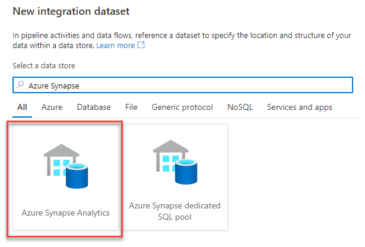

9. On the **Set properties** blade, set the field values to the following, then select **OK**.

   | Field | Value |
   |-------|-------|
   | Name  | Enter **asamcw_sale_asa**. |
   | Linked service | **SQLPool01** |
   | Table name | **wwi_mcw.SaleSmall** |  
   | Import schema | **From connection/store** |

    

10. In the top toolbar, select **Publish all** to publish the new dataset definitions. When prompted, select the **Publish** button to deploy the changes to the workspace.

    

11. Since we want to filter on multiple sale year folders (Year=2018 and Year=2019) and copy only the 2018 and 2019 sales data, we will need to create a data flow to define the specific data that we wish to retrieve from our source dataset. To create a new data flow, start by selecting **Develop** from the left menu, and in the **Develop** blade, expand the **+** button and select **Data flow**.

    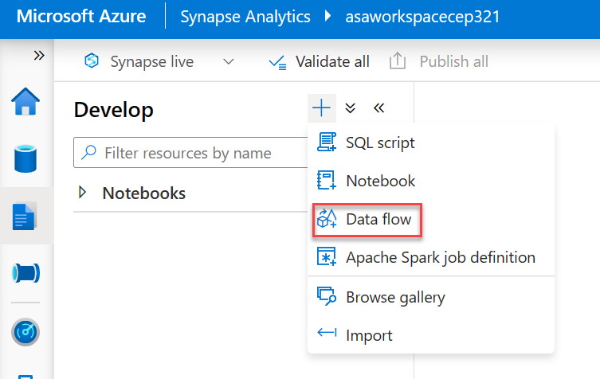

12. In the side pane on the **General** tab, name the data flow by entering **ASAMCW_Exercise_2_2018_and_2019_Sales** in the **Name** field.

    

13. In the data flow designer window, select the **Add Source** box.

    

14. With the added source selected in the designer, in the lower pane with the **Source settings** tab selected, set the following field values:
  
    | Field | Value |
    |-------|-------|
    | Output stream name  | Enter **salesdata**. |
    | Source type | **Integration Dataset** |
    | Dataset | **asamcw_sales_parquet** |

    

15. Select the **Source options** tab, and add the following as **Wildcard paths**, this will ensure that we only pull data from the parquet files for the sales years of 2018 and 2019:

    1. sale-small/Year=2018/\*/\*/\*/\*

    2. sale-small/Year=2019/\*/\*/\*/\*

      

16. At the bottom right of the **salesdata** source, expand the **+** button and select the **Sink** item located in the **Destination** section of the menu.

      

17. In the designer, select the newly added **Sink** element and in the bottom pane with the **Sink** tab selected, fill the form as follows:

    | Field | Value |
    |-------|-------|
    | Output stream name  | Enter **sale**. |
    | Incoming stream | **salesdata** |
    | Sink type | **Integration Dataset** |
    | Dataset | **asamcw_sale_asa** |

    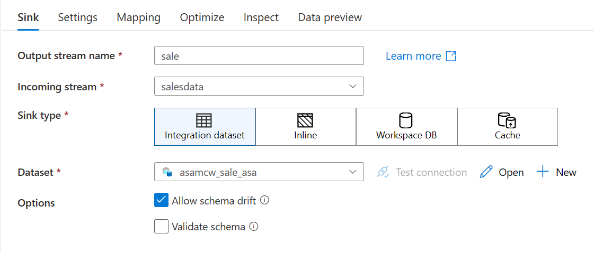

18. Select the **Mapping** tab and toggle the **Auto mapping** setting to the off position. You will need to select Input columns for the following:
  
    | Input column | Output column |
    |-------|-------|
    | Quantity | Quantity |
    | TransactionDate  | TransactionDateId |
    | Hour | Hour |
    | Minute | Minute |

    

19. In the top toolbar, select **Publish all** to publish the new dataset definitions. When prompted, select the **Publish** button to deploy the new data flow to the workspace.

    

20. We can now use this data flow as an activity in a pipeline. Create a new pipeline by selecting **Integrate** from the left menu, and in the **Integrate** blade, expand the **+** button and select **Pipeline**.

21. On the **Properties** blade, Enter **ASAMCW - Exercise 2 - Copy Sale Data** as the Name of the pipeline.

22. From the **Activities** menu, expand the **Move & transform** section and drag an instance of **Data flow** to the design surface of the pipeline.
  
    

23. Select the **Settings** tab and set the form fields to the following values:

    | Field | Value |
    |-------|-------|
    | Data flow  | **ASAMCW_Exercise_2_2018_and_2019_Sales** |
    | Staging linked service | `asadatalake{SUFFIX}` |
    | Staging storage folder - Container | Enter **staging**. |
    | Staging storage folder - Folder | Enter **mcwsales**. |

    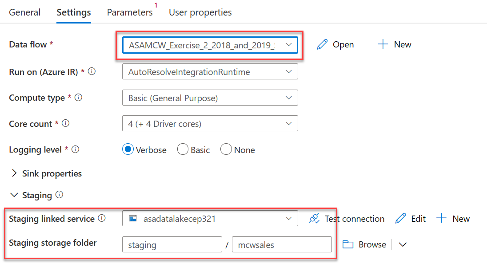

24. In the top toolbar, select **Publish all** to publish the new dataset definitions. When prompted, select the **Publish** button to commit the changes.

    

25. Once published, expand the **Add trigger** item on the pipeline designer toolbar, and select **Trigger now**. In the **Pipeline run** blade, select **OK** to proceed with the latest published configuration. You will see notification toast windows indicating the pipeline is running and when it has completed.

    > &#x1F534; **Note**: This pipeline is processing 667,049,970 rows of 2018 and 2019 sales data. Please proceed to the next task! When the pipeline completes, you will see a notification in Azure Synapse Analytics studio. At that time, you can verify your data if you choose (step 29 in this exercise).

26. View the status of the pipeline run by locating the **ASAMCW - Exercise 2 - Copy Sale Data** pipeline in the Integrate blade. Expand the actions menu and select the **Monitor** item.

    
  
27. You should see a run of the pipeline we created in the **Pipeline runs** table showing as in progress. It will take approximately 45 minutes for this pipeline operation to complete. You will need to refresh this table from time to time to see updated progress. Once it has completed. You should see the pipeline run displayed with a Status of **Succeeded**.

    > **Note**: _Feel free to proceed to the following tasks in this exercise while this pipeline runs_.

    

28. Verify the table has populated by creating a new query. Select the **Develop** item from the left menu, and in the **Develop** blade, expand the **+** button, and select **SQL script**. In the query window, be sure to connect to the SQL Pool database (`SQLPool01`), then paste and run the following query. When complete, select the **Discard all** button from the top toolbar.

  ```sql
    select count(TransactionId) from wwi_mcw.SaleSmall;
  ```

### Task 3: Create the customer information table

Over the past 5 years, Wide World Importers has amassed over 3 billion rows of sales data. With this quantity of data, the customer information lookup table is estimated to have over 100 million rows but will consume less than 1.5 GB of storage. While we will be using only a subset of this data for the lab, we will design the table for the production environment. Using the guidance outlined in the Exercising description, we can ascertain that we will need a **Clustered Columnstore** table with a **Replicated** table distribution to hold customer data.

1. Expand the left menu and select the **Develop** item. From the **Develop** blade, expand the **+** button and select the **SQL script** item.

    

2. In the query tab toolbar menu, ensure you connect to your SQL Pool, `SQLPool01`.

    

3. In the query window, copy and paste the following query to create the customer information table. Then select the **Run** button in the query tab toolbar.
  
   ```sql
    CREATE TABLE [wwi_mcw].[CustomerInfo]
    (
      [UserName] [nvarchar](100)  NULL,
      [Gender] [nvarchar](10)  NULL,
      [Phone] [nvarchar](50)  NULL,
      [Email] [nvarchar](150)  NULL,
      [CreditCard] [nvarchar](21)  NULL
    )
    WITH
    (
      DISTRIBUTION = REPLICATE,
      CLUSTERED COLUMNSTORE INDEX
    )
    GO
   ```

   

4. At the far right of the top toolbar, select the **Discard all** button as we will not be saving this query. When prompted, choose to **Discard changes**.

   

### Task 4: Populate the customer information table

1. We will need to do is define a source dataset that will represent the information that we are copying over. This dataset will reference the CSV file containing customer information. From the left menu, select **Data**. From the **Data** blade, expand the **+** button and select **Integration Dataset**.

    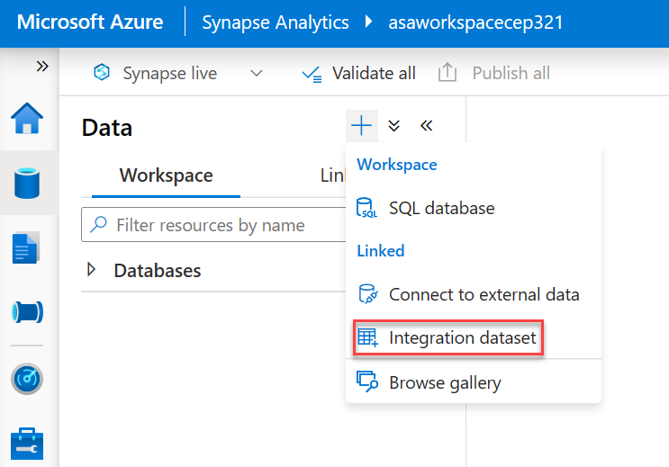

2. On the **New integration dataset** blade, with the **Azure** tab selected, choose the **Azure Data Lake Gen2** item. Select **Continue**.  
  
    

3. On the **Select format** blade, select **CSV Delimited Text**. Select **Continue**.

    

4. On the **Set properties** blade, set the fields to the following values, then select **OK**.

   | Field | Value |
   |-------|-------|
   | Name  | Enter **asamcw_customerinfo_csv**. |
   | Linked service | **asadatalake{SUFFIX}**|
   | File Path - Container | Enter **wwi-02**. |
   | File Path - Directory | Enter **customer-info**. |
   | File Path - File | Enter **customerinfo.csv**. |
   | First row as header | Checked |
   | Import schema | Select **From connection/store**. |

    

5. Now we will need to define the destination dataset for our data. In this case we will be storing customer information data in our SQL Pool. On the **Data** blade, expand the **+** button and select **Integration dataset**.

6. On the **New integration dataset** blade, enter **Azure Synapse** as a search term and select the **Azure Synapse Analytics** item. Select **Continue**.

    

7. On the **Set properties** blade, set the field values to the following, then select **OK**.

   | Field | Value |
   |-------|-------|
   | Name  | Enter **asamcw_customerinfo_asa**. |
   | Linked service | **SQLPool01** |
   | Table name | **wwi_mcw.CustomerInfo** |  
   | Import schema | **From connection/store** |

    

8. In the top toolbar, select **Publish all** to publish the new dataset definitions. When prompted, select the **Publish** button to commit the changes.

    

9. Next, we will define a pipeline to populate data into the CustomerInfo table. From the left menu, select **Integrate**. From the Integrate blade, select the **+** button and select the **Pipeline** item.

    

10. In the **Properties** blade, enter **ASAMCW - Exercise 2 - Copy Customer Information** in the **Name** field.

    

11. In the **Activities** menu, expand the **Move & transform** item. Drag an instance of the **Copy data** activity to the design surface of the pipeline.

    

12. Select the **Copy data** activity on the pipeline design surface. In the bottom pane, on the **General** tab, enter **Copy Customer Information Data** in the **Name** field.

    

13. Select the **Source** tab in the bottom pane. In the **Source dataset** field, select **asamcw_customerinfo_csv**.

    
  
14. Select the **Sink** tab in the bottom pane. In the **Sink dataset** field, select **asamcw_customerinfo_asa**, for the **Copy method** field, select **Bulk insert**, and for **Pre-copy script** enter:

    ```sql
      truncate table wwi_mcw.CustomerInfo
    ```

    
  
15. Select the **Mapping** tab in the bottom pane. Select the **Import schemas** button. You will notice that Azure Synapse Analytics automated the mapping for us since the field names and types match.

    

16. In the top toolbar, select **Publish all** to publish the new dataset definitions. When prompted, select the **Publish** button to commit the changes.

    

17. Once published, expand the **Add trigger** item on the pipeline designer toolbar, and select **Trigger now**. In the **Pipeline run** blade, select **OK** to proceed with the latest published configuration. You will see notification toast windows indicating the pipeline is running and when it has completed.

18. View the status of the completed run by locating the **ASAMCW - Exercise 2 - Copy Customer Information** pipeline in the Integrate blade. Expand the actions menu, and select the **Monitor** item.

    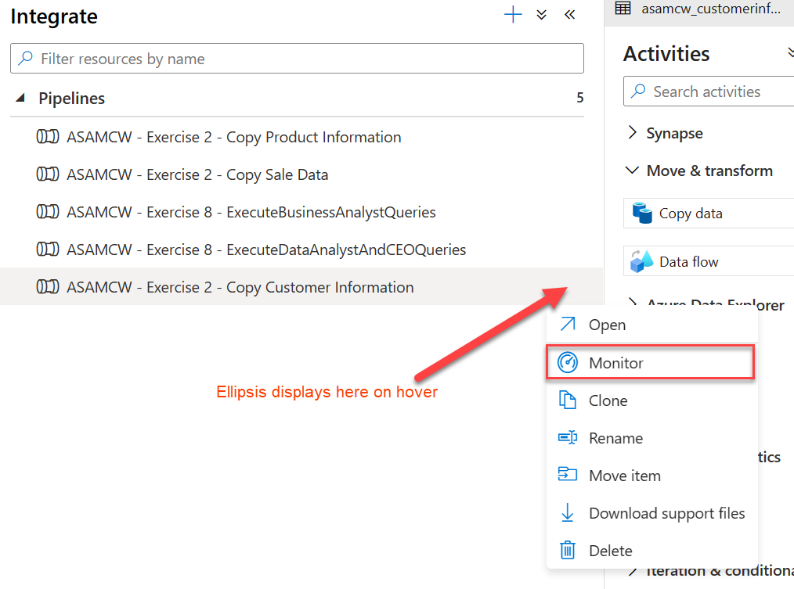

19. You should see a successful run of the pipeline we created in the **Pipeline runs** table.
  
    

20. Verify the table has populated by creating a new query. Remember from **Task 1**, select the **Develop** item from the left menu, and in the **Develop** blade, expand the **+** button, and select **SQL script**. In the query window, be sure to connect to the SQL Pool database (`SQLPool01`), then paste and run the following query. When complete, select the **Discard all** button from the top toolbar.

  ```sql
    select * from wwi_mcw.CustomerInfo;
  ```

### Task 5: Create the campaign analytics table

The campaign analytics table will be queried primarily for dashboard and KPI purposes. Performance is a large factor in the design of this table, and as such  we can ascertain that we will need a **Clustered Columnstore** table with a **Hash** table distribution based on the **Region** field which will fairly evenly distribute the data.

1. Expand the left menu and select the **Develop** item. From the **Develop** blade, expand the **+** button and select the **SQL script** item.

    

2. In the query tab toolbar menu, ensure you connect to your SQL Pool, `SQLPool01`.

    

3. In the query window, copy and paste the following query to create the campaign analytics table. Then select the **Run** button in the query tab toolbar.

    ```sql
    CREATE TABLE [wwi_mcw].[CampaignAnalytics]
    (
        [Region] [nvarchar](50)  NULL,
        [Country] [nvarchar](30)  NOT NULL,
        [ProductCategory] [nvarchar](50)  NOT NULL,
        [CampaignName] [nvarchar](500)  NOT NULL,
        [Analyst] [nvarchar](25) NULL,
        [Revenue] [decimal](10,2)  NULL,
        [RevenueTarget] [decimal](10,2)  NULL,
        [City] [nvarchar](50)  NULL,
        [State] [nvarchar](25)  NULL
    )
    WITH
    (
        DISTRIBUTION = HASH ( [Region] ),
        CLUSTERED COLUMNSTORE INDEX
    );  
    ```

    

4. At the far right of the top toolbar, select the **Discard all** button as we will not be saving this query. When prompted, choose to **Discard changes**.

   

### Task 6: Populate the campaign analytics table

Similar to the customer information table, we will also be populating the campaign analytics table via a CSV file located in the data lake. This will require source and sink datasets to point to the CSV file in storage and the campaign analytics table that you just created in the SQL Pool. The source CSV file that was received is poorly formatted - we will need to add data transformations to make adjustments to this data before it is imported into the data warehouse.

1. The source dataset will reference the CSV file containing campaign analytics information. From the left menu, select **Data**. From the **Data** blade, expand the **+** button and select **Integration dataset**.

    

2. On the **New integration dataset** blade, with the **All** tab selected, choose the **Azure Data Lake Storage Gen2** item. Select **Continue**.  
  
    

3. On the **Select format** blade, select **CSV Delimited Text**. Select **Continue**.

    

4. On the **Set properties** blade, set the fields to the following values, then select **OK**. You may choose to preview the data which will show a sample of the CSV file. Notice that since we are not setting the first row as the header, the header columns appear as the first row. Also, notice that the city and state values do not appear. This is because of the mismatch in the number of columns in the header row compared to the rest of the file. Soon, we will exclude the first row as we transform the data.

   | Field | Value |
   |-------|-------|
   | Name  | Enter **asamcw_campaignanalytics_csv** |
   | Linked service | Select **asadatalake{SUFFIX}**.|
   | File Path - Container | Enter **wwi-02** |
   | File Path - Directory | Enter **campaign-analytics** |
   | File Path - File | Enter **campaignanalytics.csv** |
   | First row as header | Unchecked |
   | Import schema | Select **From connection/store** |

    

5. On the **Connection** tab of **asamcw_campainganalytics_csv** dataset, ensure the following field values are set:

   | Field | Value |
   |-------|-------|
   | Escape Character  | **Backslash (\\\)** |
   | Quote Character | **Double quote (")** |  

6. Now we will need to define the destination dataset for our data. In this case we will be storing campaign analytics data in our SQL Pool. On the **Data** blade, expand the **+** button and select **Integration dataset**.

7. On the **New integration dataset** blade, enter **Azure Synapse** as a search term and select the **Azure Synapse Analytics** item. Select **Continue**.

    
  
8. On the **Set properties** blade, set the field values to the following, then select **OK**.

   | Field | Value |
   |-------|-------|
   | Name  | Enter **asamcw_campaignanalytics_asa**. |
   | Linked service | **SQLPool01** |
   | Table name | **wwi_mcw.CampaignAnalytics** |  
   | Import schema | Select **From connection/store**. |

    

9. In the top toolbar, select **Publish all** to publish the new dataset definitions. When prompted, select the **Publish** button to commit the changes.

    

10. Since our source data is malformed and does not contain an Analyst column, we will need to create a data flow to transform the source data. A data flow allows you to graphically define dataset filters and transformations without writing code. These data flows can be leveraged as an activity in an integration pipeline. Create a new data flow, start by selecting **Develop** from the left menu, and in the **Develop** blade, expand the **+** button and select **Data flow**.

    

11. In the **Properties** blade name the data flow by entering **ASAMCW_Exercise_2_Campaign_Analytics_Data** in the **Name** field.

    

12. In the data flow designer window, select the **Add Source** box.

    

13. Under **Source settings**, configure the following:

    | Field | Value |
    |-------|-------|
    | Output stream name  | Enter **campaignanalyticscsv**. |
    | Source type | **Integration Dataset** |
    | Dataset | **asamcw_campaignanalytics_csv** |
    | Skip line count | Enter **1**. |  

    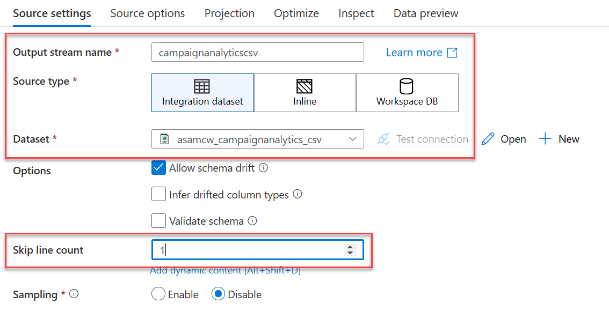

14. When you create data flows, certain features are enabled by turning on debug, such as previewing data and importing a schema (projection). Due to the amount of time it takes to enable this option, as well as environmental constraints of the lab environment, we will bypass these features. The data source has a schema we need to set. To do this, select **Script** from the right side of the dataflow designer toolbar menu.

    

15. Replace the script with the following to provide the column mappings (`output`), then select **OK**:

    ```json
        source(output(
            {_col0_} as string,
            {_col1_} as string,
            {_col2_} as string,
            {_col3_} as string,
            {_col4_} as string,
            {_col5_} as double,
            {_col6_} as string,
            {_col7_} as double,
            {_col8_} as string,
            {_col9_} as string
        ),
        allowSchemaDrift: true,
        validateSchema: false,
        skipLines: 1) ~> campaignanalyticscsv
    ```

    > **Note**: We are changing the mappings as the source file was corrupted with the wrong headers.

16. Select the **campaignanalyticscsv** data source, then select **Projection**. The projection should display the following schema:

    

17. Select the **+** to the bottom right of the **campaignanalyticscsv** source, then select the **Select** schema modifier from the context menu.

    

18. In the bottom pane, under **Select settings**, configure the following:

    | Field | Value |
    |-------|-------|
    | Output stream name  | Enter **mapcampaignanalytics**. |

    For **Input Columns**, under the **Name as** column, enter the following list values in order:
      - Region
      - Country
      - ProductCategory
      - CampaignName
      - RevenuePart1
      - Revenue
      - RevenueTargetPart1
      - RevenueTarget
      - City
      - State

    

19. Select the **+** to the right of the **mapcampaignanalytics** source, then select the **Derived Column** schema modifier from the context menu.

20. Under **Derived column's settings**, configure the following:

    | Field | Value |
    |-------|-------|
    | Output stream name  | Enter **convertandaddcolumns**. |

    For **Columns**, add the following (Note: you will need to type in the **Analyst** column and use the **open expression builder** link to enter the expression values):

    | Column | Expression | Description |
    | --- | --- | --- |
    | Revenue | **toDecimal(replace(concat(toString(RevenuePart1), toString(Revenue)), '\\\\', ''), 10, 2, '$###,###.##')** | Concatenate the **RevenuePart1** and **Revenue** fields, replace the invalid `\` character, then convert and format the data to a decimal type. |
    | RevenueTarget | **toDecimal(replace(concat(toString(RevenueTargetPart1), toString(RevenueTarget)), '\\\\', ''), 10, 2, '$###,###.##')** | Concatenate the **RevenueTargetPart1** and **RevenueTarget** fields, replace the invalid `\` character, then convert and format the data to a decimal type. |
    | Analyst | **iif(isNull(City), '',  replace('DataAnalyst'+ City,' ',''))** | If the city field is null, assign an empty string to the Analyst field, otherwise concatenate DataAnalyst to the City value, removing all spaces. |

    

21. Select the **+** to the right of the **convertandaddcolumns** step, then select the **Select** schema modifier from the context menu.

22. Under **Select settings**, configure the following:

    | Field | Value |
    |-------|-------|
    | Output stream name  | Enter **selectcampaignanalyticscolumns**. |
    | Input columns | Delete the **RevenuePart1** and **RevenueTargetPart1** columns. |

    

23. Select the **+** to the right of the **selectcampaignanalyticscolumns** step, then select the **Sink** destination from the context menu.

24. In the bottom pane, on the **Sink** tab, configure it as follows:

    | Field | Value |
    |-------|-------|
    | Output stream name  | Enter **campaignanlyticsasa**. |
    | Dataset | **asamcw_campaignanalytics_asa** |

    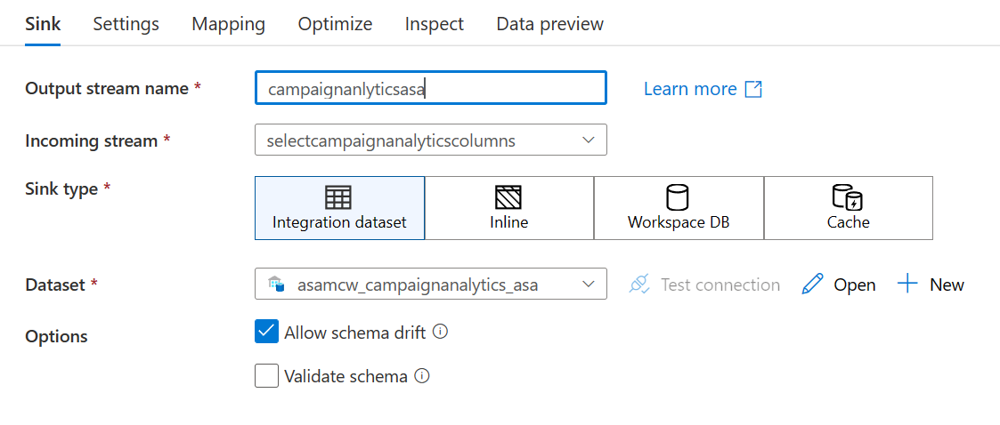

25. Select **Settings** tab, and for **Table action** select **Truncate table**.

    

26. Your completed data flow should look similar to the following:

    
  
27. Select **Publish all** to save your new data flow.

    

28. Now that the data flow is published, we can use it in a pipeline. Create a new pipeline by selecting **Integrate** from the left menu, then in the **Integrate** blade, expand the **+** button and select **Pipeline**.

29. In the **Properties** pane on the right side of the pipeline designer. Enter **ASAMCW - Exercise 2 - Copy Campaign Analytics Data** in the **Name** field.

    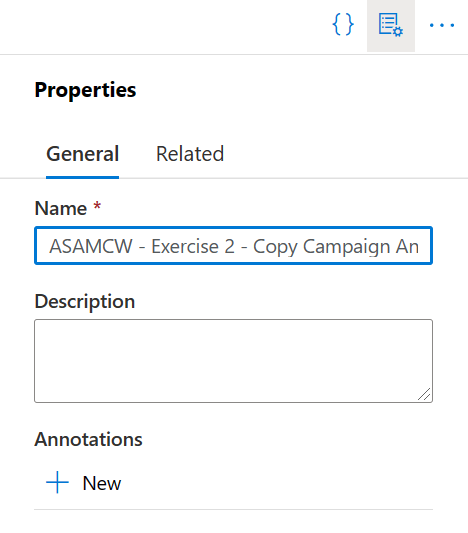

30. From the **Activities** menu, expand the **Move & transform** section and drag an instance of **Data flow** to the design surface of the pipeline.
  
    

31. In the bottom pane, select the **Settings** tab and set the form fields to the following values:

    | Field | Value |
    |-------|-------|
    | Data flow  | **ASAMCW_Exercise_2_Campaign_Analytics_Data** |
    | Staging linked service | **asadatalake{SUFFIX}** |
    | Staging storage folder - Container | Enter **staging**. |
    | Staging storage folder - Directory | Enter **mcwcampaignanalytics**. |

    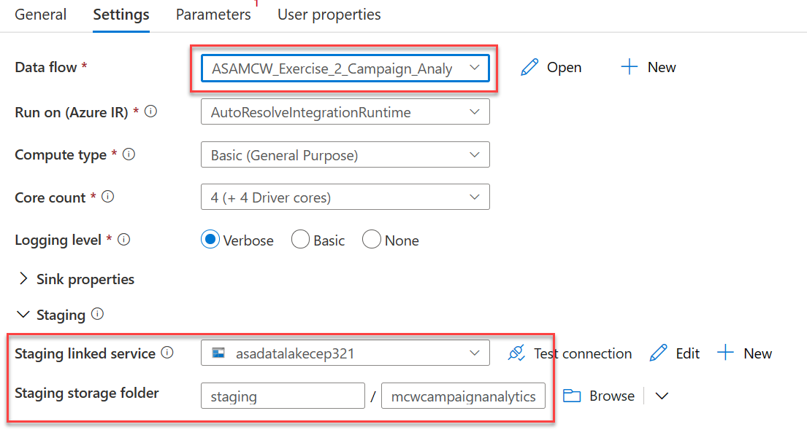

32. In the top toolbar, select **Publish all** to publish the new pipeline. When prompted, select the **Publish** button to commit the changes.

    

33. Once published, expand the **Add trigger** item on the pipeline designer toolbar, and select **Trigger now**. In the **Pipeline run** blade, select **OK** to proceed with the latest published configuration. You will see notification toast window indicating the pipeline is running and when it has completed.

34. View the status of the pipeline run by locating the **ASAMCW - Exercise 2 - Copy Campaign Analytics Data** pipeline in the Integrate blade. Expand the actions menu, and select the **Monitor** item.

    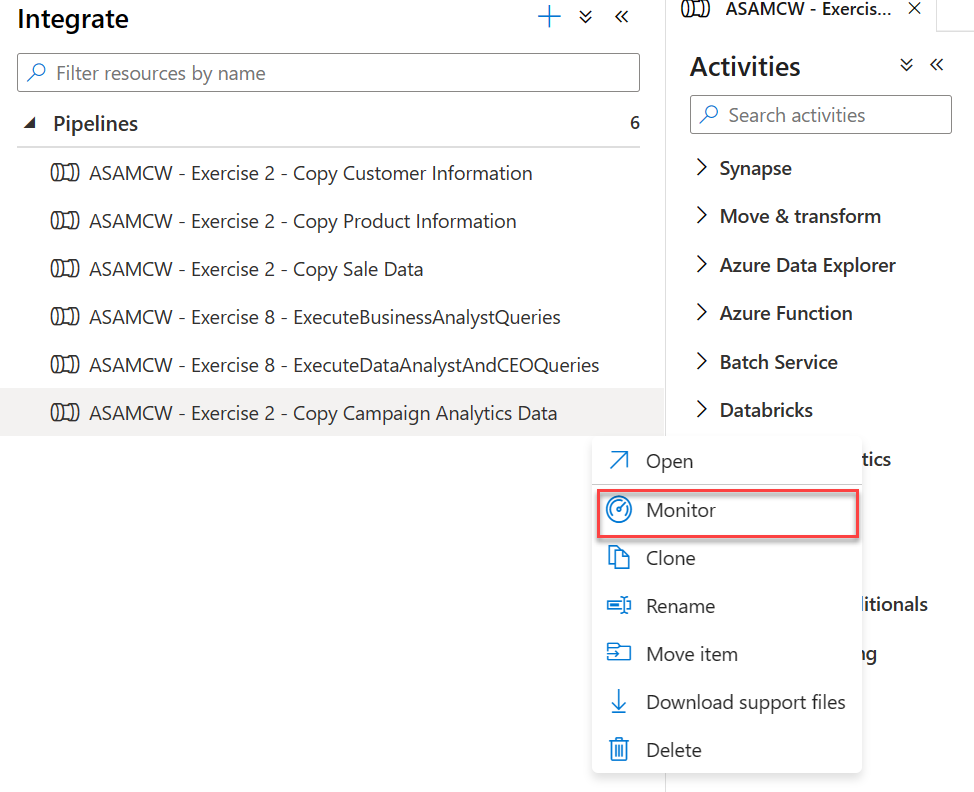

35. You should see a run of the pipeline we created in the **Pipeline runs** table showing as in progress. You will need to refresh this table from time to time to see updated progress. Once it has completed. You should see the pipeline run displayed with a Status of **Succeeded**.

36. Verify the table has populated by creating a new query. Select the **Develop** item from the left menu, and in the **Develop** blade, expand the **+** button, and select **SQL script**. In the query window, be sure to connect to the SQL Pool database (`SQLPool01`), then paste and run the following query. When complete, select the **Discard all** button from the top toolbar.

  ```sql
    select count(Region) from wwi_mcw.CampaignAnalytics;
  ```

### Task 7: Populate the product table

When the lab environment was provisioned, the **wwi_mcw.Product** table and datasets required for its population were created. Throughout this exercise, you have gained experience creating datasets, data flows, and pipelines. The population of the product table would be repetitive, so we will simply trigger an existing pipeline to populate this table.

1. From the left menu, select **Integrate**. From the **Integrate** blade, expand the **Pipelines** section and locate and select the **ASAMCW - Exercise 2 - Copy Product Information** pipeline.

2. Expand the **Add trigger** item on the pipeline designer toolbar, and select **Trigger now**. In the **Pipeline run** blade, select **OK** to proceed with the latest published configuration. You will see notification toast windows indicating the pipeline is running and when it has completed.

3. View the status of the pipeline run by locating the **ASAMCW - Exercise 2 - Copy Product Information** pipeline in the Integrate blade. Expand the actions menu, and select the **Monitor** item.

4. You should see a run of the pipeline we created in the **Pipeline runs** table showing as in progress (or succeeded). Once it has completed. You should see the pipeline run displayed with a Status of **Succeeded**.

5. Verify the table has populated by creating a new query. Select the **Develop** item from the left menu, and in the **Develop** blade, expand the **+** button, and select **SQL script**. In the query window, be sure to connect to the SQL Pool database (`SQLPool01`), then paste and run the following query. When complete, select the **Discard all** button from the top toolbar.

  ```sql
    select * from wwi_mcw.Product;
  ```


