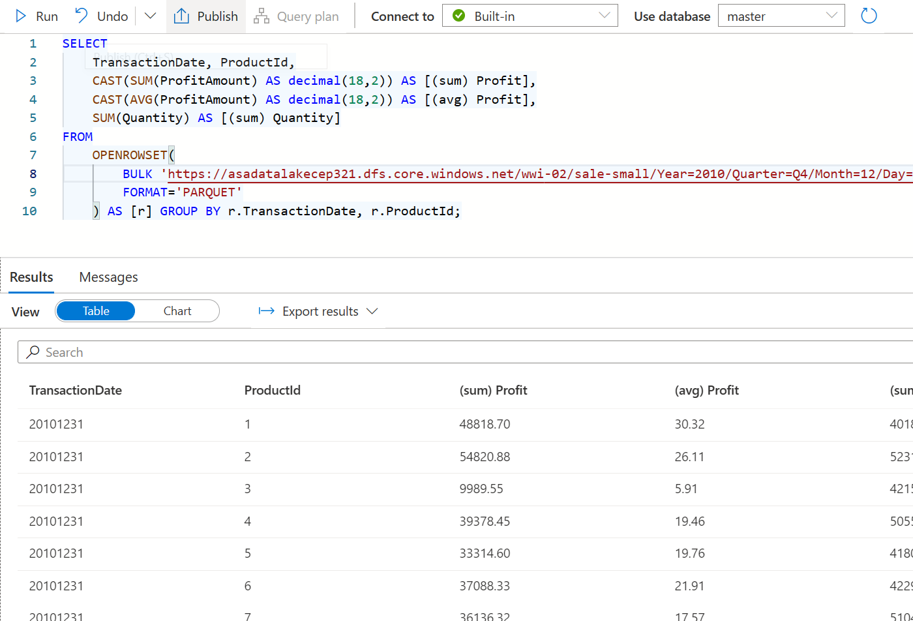

# Azure Synapse Analytics and AI hands-on lab step-by-step


## Exercise 3: Exploring raw parquet


### Task 1: Query sales Parquet data with Synapse SQL Serverless

When you query Parquet files using Synapse SQL Serverless, you can explore the data with T-SQL syntax.

1. From the left menu, select **Data**.

2. From the **Data** blade, select the **Linked** tab.

3. Expand **Azure Data Lake Storage Gen2**. Expand the `asadatalake{SUFFIX}` ADLS Gen2 account and select **wwi-02**.

4. Navigate to the **wwi-02/sale-small/Year=2010/Quarter=Q4/Month=12/Day=20101231** folder. Right-click on the **sale-small-20101231-snappy.parquet** file, select **New SQL script**, then **Select TOP 100 rows**.

    

5. Ensure the **Built-in** Synapse SQL Serverless pool is selected in the **Connect to** dropdown list above the query window, then run the query. Data is loaded by the Synapse SQL Serverless endpoint and processed as if was coming from any regular relational database.

    

6. Modify the SQL query to perform aggregates and grouping operations to better understand the data. Replace the query with the following, making sure that the file path in **OPENROWSET** matches your current file path, be sure to substitute `asadatalake{SUFFIX}` for the appropriate value in your environment:

    ```sql
    SELECT
        TransactionDate, ProductId,
        CAST(SUM(ProfitAmount) AS decimal(18,2)) AS [(sum) Profit],
        CAST(AVG(ProfitAmount) AS decimal(18,2)) AS [(avg) Profit],
        SUM(Quantity) AS [(sum) Quantity]
    FROM
        OPENROWSET(
            BULK 'https://asadatalake{SUFFIX}.dfs.core.windows.net/wwi-02/sale-small/Year=2010/Quarter=Q4/Month=12/Day=20101231/sale-small-20101231-snappy.parquet',
            FORMAT='PARQUET'
        ) AS [r] GROUP BY r.TransactionDate, r.ProductId;
    ```

    

7. Now let's figure out how many records are contained within the Parquet files for 2019 data. This information is important for planning how we optimize for importing the data into Azure Synapse Analytics. To do this, replace your query with the following (be sure to update the name of your data lake in BULK statement, by replacing `asadatalake{SUFFIX}`):

    ```sql
    SELECT
        COUNT_BIG(*)
    FROM
        OPENROWSET(
            BULK 'https://asadatalake{SUFFIX}.dfs.core.windows.net/wwi-02/sale-small/Year=2019/*/*/*/*',
            FORMAT='PARQUET'
        ) AS [r];
    ```

    > Notice how we updated the path to include all Parquet files in all subfolders of `sale-small/Year=2019`.

    The output should be **339507246** records.

### Task 2: Query sales Parquet data with Azure Synapse Spark

1. Select **Data** from the left menu, select the **Linked** tab, then browse to the data lake storage account `asadatalake{SUFFIX}` to  **wwi-02/sale-small/Year=2010/Quarter=Q4/Month=12/Day=20101231**, then right-click the Parquet file and select **New notebook** then **Load to DataFrame**.

    

2. This will generate a notebook with PySpark code to load the data in a dataframe and display 100 rows with the header.

3. Attach the notebook to a Spark pool. Your Spark pool may not be running and will not have the green checkmark, it is fine to proceed.

    

4. Select **Run all** on the notebook toolbar to execute the notebook.

    > **Note:** The first time you run a notebook in a Spark pool, Synapse creates a new session. This can take approximately 5 minutes.

    > **Note:** To run just the cell, either hover over the cell and select the _Run cell_ icon to the left of the cell, or select the cell then type **Ctrl+Enter** on your keyboard.

5. Create a new cell underneath by selecting **{} Add code** when hovering over the blank space at the bottom of the notebook.

    

6. The Spark engine can analyze the Parquet files and infer the schema. To do this, enter the following in the new cell, then execute the cell by pressing SHIFT + Enter:

    ```python
    df.printSchema()
    ```

    Your output should look like the following:

    ```text
    root
        |-- TransactionId: string (nullable = true)
        |-- CustomerId: integer (nullable = true)
        |-- ProductId: short (nullable = true)
        |-- Quantity: short (nullable = true)
        |-- Price: decimal(29,2) (nullable = true)
        |-- TotalAmount: decimal(29,2) (nullable = true)
        |-- TransactionDate: integer (nullable = true)
        |-- ProfitAmount: decimal(29,2) (nullable = true)
        |-- Hour: byte (nullable = true)
        |-- Minute: byte (nullable = true)
        |-- StoreId: short (nullable = true)
    ```

7. Now let's use the dataframe to perform the same grouping and aggregate query we performed with the SQL Serverless pool. Create a new cell and enter the following:

    ```python
    from pyspark.sql import SparkSession
    from pyspark.sql.types import *
    from pyspark.sql.functions import *
    
    profitByDateProduct = (df.groupBy("TransactionDate", "ProductId")
    .agg(
    round(sum("ProfitAmount"),2).alias("(sum)Profit"),
    round(avg("ProfitAmount"),2).alias("(avg)Profit"),
    sum("Quantity").alias("(sum)Quantity")
    ).orderBy("TransactionDate", "ProductId")
    )
    profitByDateProduct.show(100)
    ```

 > We import required Python libraries to use aggregation functions and types defined in the schema to successfully execute the query.


