# Azure Synapse Analytics and AI hands-on lab step-by-step


## Exercise 5: Machine Learning


### Task 1: Grant Contributor rights to the Azure Machine Learning Workspace to the Synapse Workspace Managed Identity

Azure Synapse Analytics supports using Managed Identities for authentication across services instead of using traditional credentials or secrets. A Managed Identity, which can be created automatically at the time a service is provisioned or separately and associated later, is authenticated using Azure Active Directory and represents the service itself when interacting with other Azure resources.

In this task, the Synapse Workspace Managed Identity will be granted **Contributor** rights to the Azure Machine Learning workspace.

1. In the Azure Portal, open the lab resource group, then select the Machine Learning resource named amlworkspace{SUFFIX}.

2. From the left menu, select **Access control (IAM)**

3. Expand the Add button and choose **Add role assignment**.

    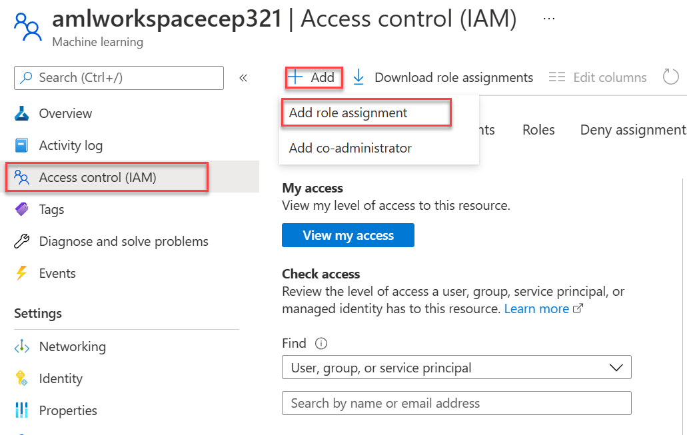

4. On the **Add role assignment** screen, select **Contributor** from the list, then choose **Next**.

    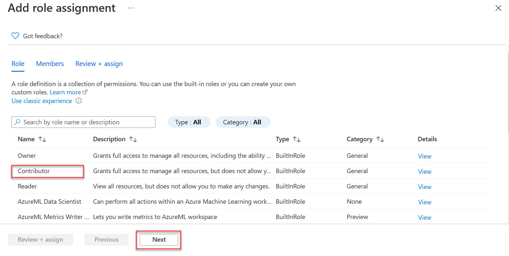

5. On the **Add role assignment** Members tab, select **Managed identity** for the **Assign access to** field. Then, select the **+ Select members** link beneath the **Members** field.

    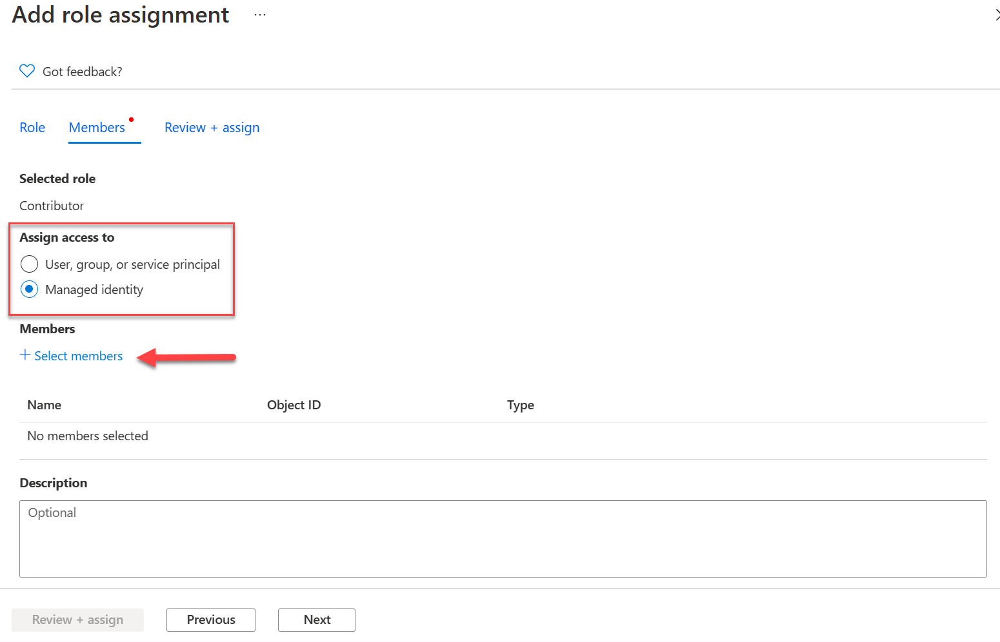

6. On the **Select managed identities** blade, choose the **Managed identity** type of Synapse workspace, then select the lab workspace (asaworkspace{SUFFIX}) from the listing. Choose **Select**.

    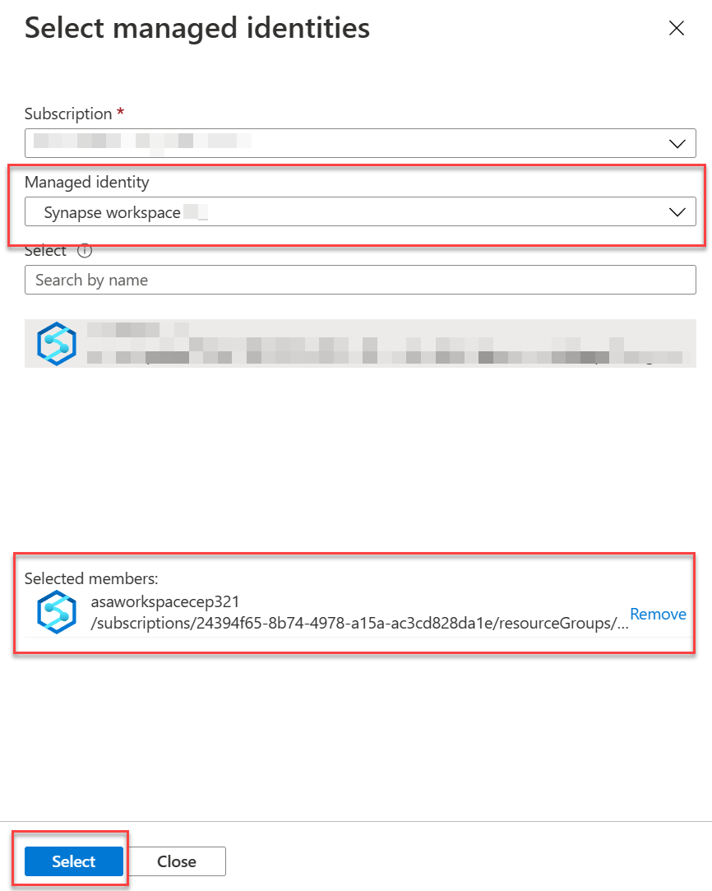

7. Back on the role assignment blade, select **Review + assign**, then **Review + assign** once more.

### Task 2: Create a linked service to the Azure Machine Learning workspace

The Azure Synapse Analytics managed identity now has Contributor access to the Azure Machine Learning Workspace. To complete the integration between these products, we will establish a linked service between both resources.

1. Return to **Synapse Studio**.

2. From the left menu, select the **Manage** hub.

3. From the Manage hub menu, select **Linked services**, then select **+ New** from the toolbar menu.

    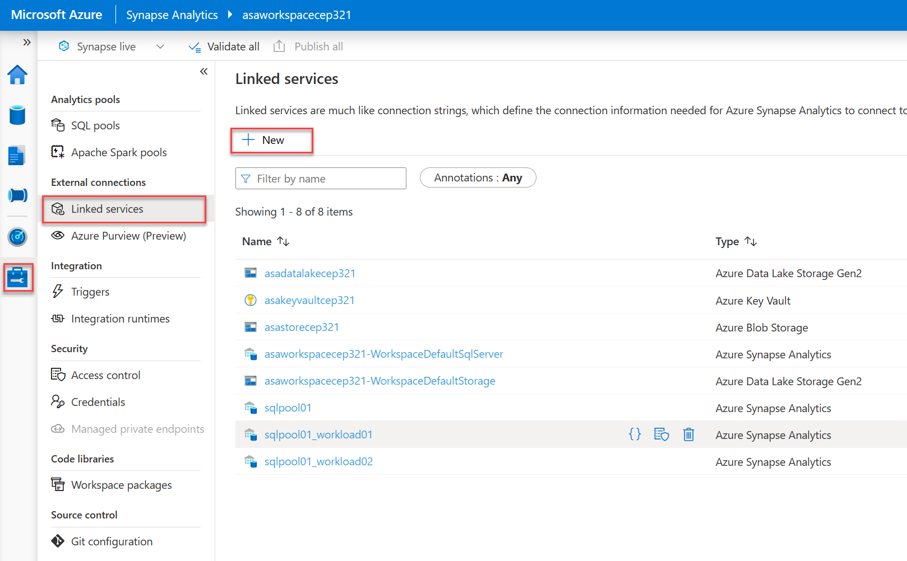

4. On the **New linked service** blade, search for and select **Azure Machine Learning**. Select **Continue**.

    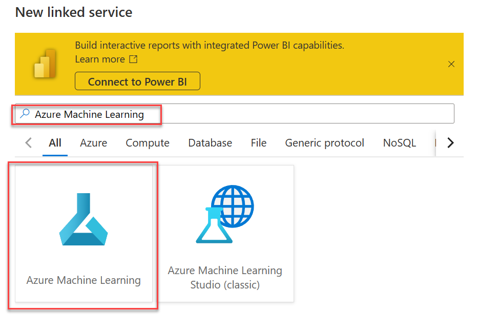

5. On the **New linked service (Azure Machine Learning)** blade, fill the form with the values specified below, then select the **Create** button. Values not listed in the table below should retain their default value.

    | Field | Value |
    |-------|-------|
    | Name | Enter `azuremachinelearning`. |
    | Azure subscription | Select the lab subscription. |
    | Azure Machine Learning workspace name | Select **amlworkspace{SUFFIX}**. |

    ")

6. Select the **Publish all** button from the Synapse Studio toolbar, then select **Publish** on the confirmation blade.

   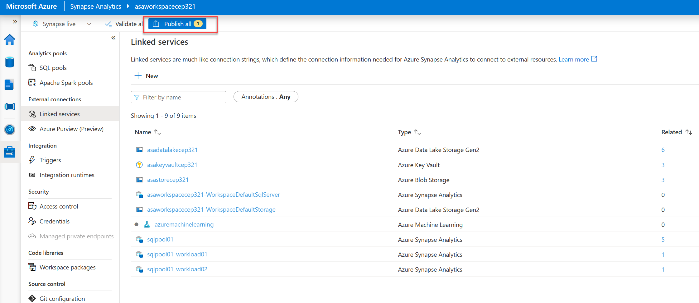

### Task 3: Prepare data for model training using a Synapse notebook

we need to create a Spark table as a starting point for the Machine Learning model training process.

1. In Synapse Studio, select the **Develop** hub. Then, expand the **+** menu and choose the **Notebook** item.

    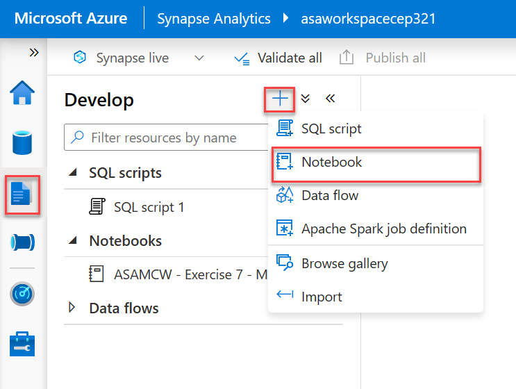

2. In the Synapse Notebook, ensure you attach to **SparkPool01**, then in the first cell, paste the following code. Ensure you replace **{SUFFIX}** with the appropriate value for your lab. This table serves as the training data set for our regression model that will predict the product forecast. Run this cell to create the Spark table.

    ```Python
    import pyspark.sql.functions as f

    df = spark.read.load('abfss://wwi-02@asadatalake{SUFFIX}.dfs.core.windows.net/sale-small/Year=2019/Quarter=Q4/Month=12/*/*.parquet', format='parquet')
    
    df_consolidated = df.groupBy('ProductId', 'TransactionDate', 'Hour').agg(f.sum('Quantity').alias('TotalQuantity'))
    
    # Create a Spark table with aggregated sales data to serve as the training dataset
    df_consolidated.write.mode("overwrite").saveAsTable("default.SaleConsolidated")
    ```

3. In Synapse Studio, select the **Data** hub from the left menu. On the **Workspace** tab, expand the **Databases** node, then expand the **default (Spark)** node. Expand the **Tables** item, and you should see the **saleconsolidated** table that was created in the following step. If you don't see this table, expand the action menu next to the **Table** node and select the **Refresh** item.

    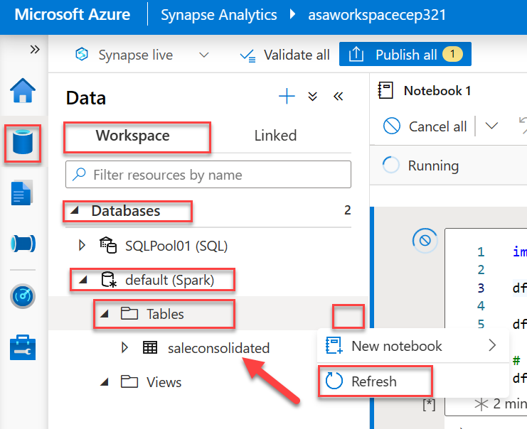

4. You may close and discard the notebook.

### Task 4: Leverage the Azure Machine Learning integration to train a regression model

1. Next to the **saleconsolidated** Spark table, expand the actions menu, and select **Machine Learning**, then **Train a new model**.

    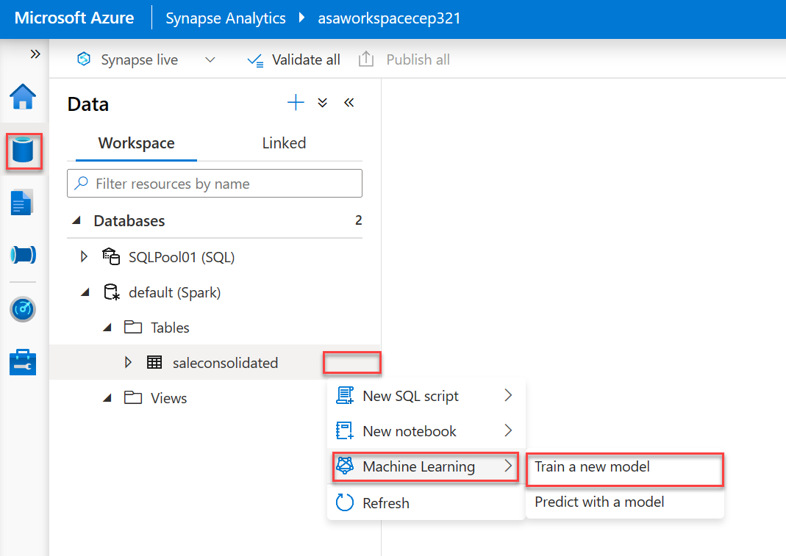

2. In the **Train a new model** blade, select **Regression** as the model type, then select **Continue**.

    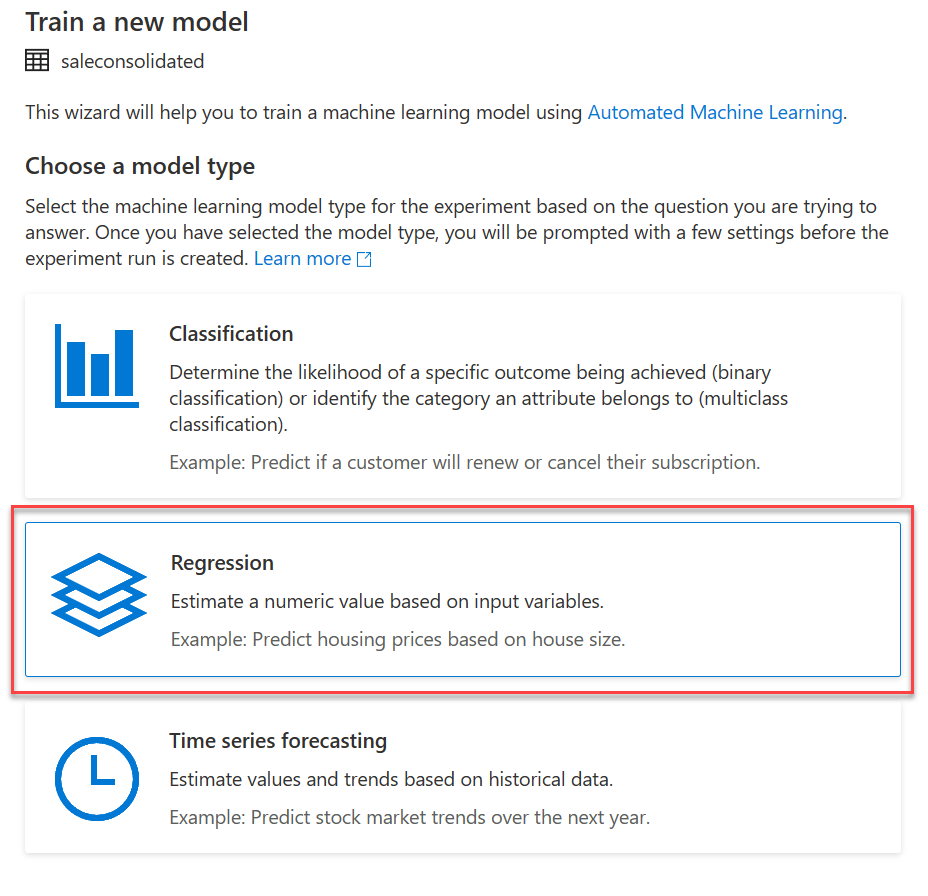

3. In the **Train a new model (Regression)** blade, fill the values as follows. Fields not listed in the table below retain their default values. Copy the value of the **Best model name** to a text editor for use later in this lab. When complete, select the **Continue** button. This form configures the AutoML experiment.

    | Field | Value |
    |--------|------|
    | Azure Machine Learning workspace | Select **amlworkspace{SUFFIX}**. |
    | Target column | Select **TotalQuantity (long)**. |
    | Apache Spark pool | Select **SparkPool01**. |

    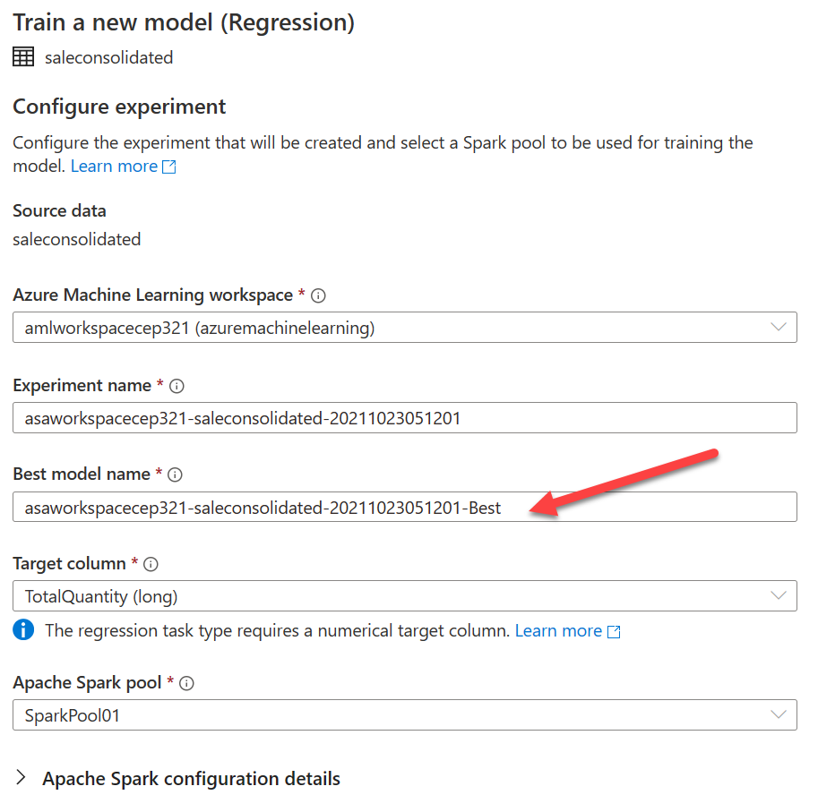

4. In the **Configure regression model** form, set the Maximum training job time (hours) to `0.25`, and the **ONNX model compatibility** to **Enable**. This will let the experiment run for 15 minutes and output an ONNX compatible model.

    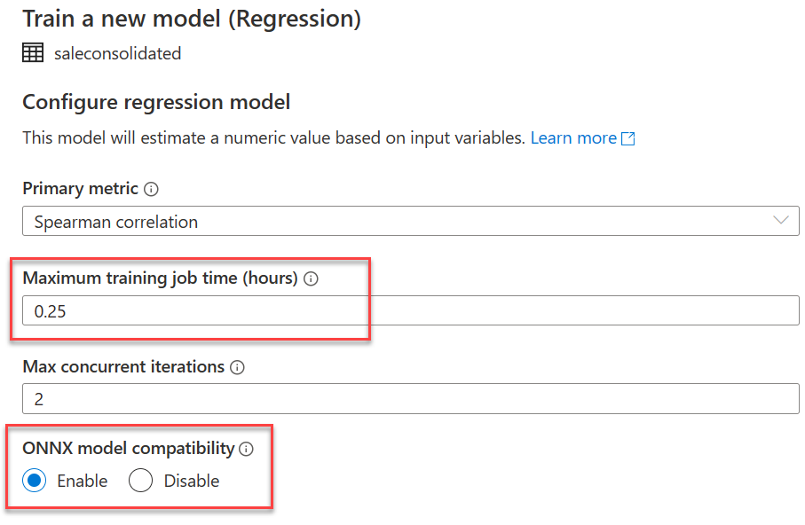

5. Select **Open in notebook**. This will display the generated experiment code that integrates with Azure Machine Learning. Alternatively, you could have chosen **Create run** and have it issue the Automated Machine Learning experiment directly with the linked Azure Machine Learning workspace without ever having to look at the code.

6. After reviewing the code, select **Run all** from the top toolbar menu.

    >**Note**: This experiment will take up to 20 minutes to run. Proceed to the following exercise and return to this point after the notebook run has completed. Alternatively, the output of the experiment contains a link to the Azure Machine Learning workspace where you can view the details of the currently running experiment.

    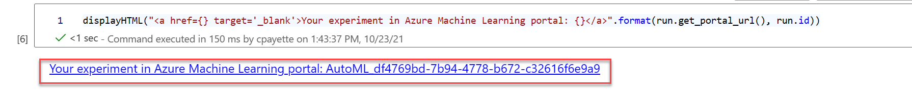

### Task 5: Review the experiment results in Azure Machine Learning Studio

1. In the Azure Portal, open the lab resource group and select the **amlworkspace{SUFFIX}** Azure Machine Learning resource. Select **Launch studio** to open the Azure Machine Learning Studio.

2. The notebook generated in the previous task registered the best trained model for the experiment. You can locate the model by selecting **Models** from the left menu. Note the model in the list, this is the model that was trained in the previous task.

    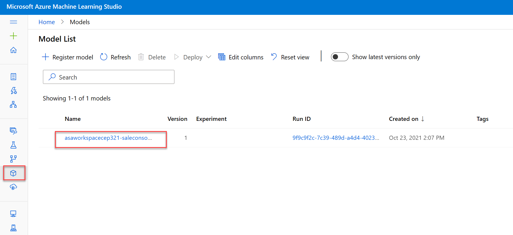

3. From the left menu, select the **Automated ML** item, then in the **Recent Automated ML runs** select the **Display name** link.

    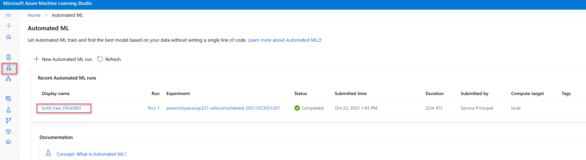

4. On the Automated ML screen, locate the **Best model summary** card that identifies the best model identified for the run. This should match the model that was registered in the workspace.

    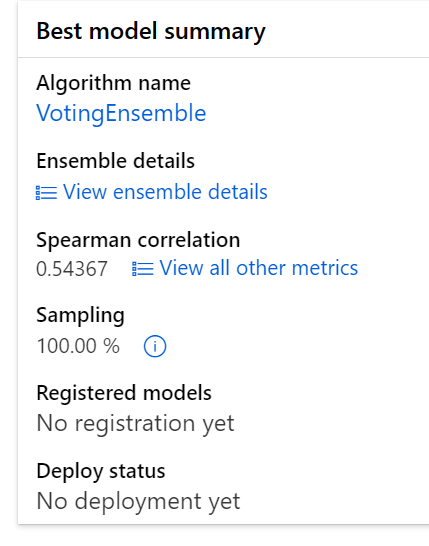

5. Select the **Models** tab for the Automated ML run. This will display a listing of candidate models that were evaluated. The best model is located at the top of the list.

    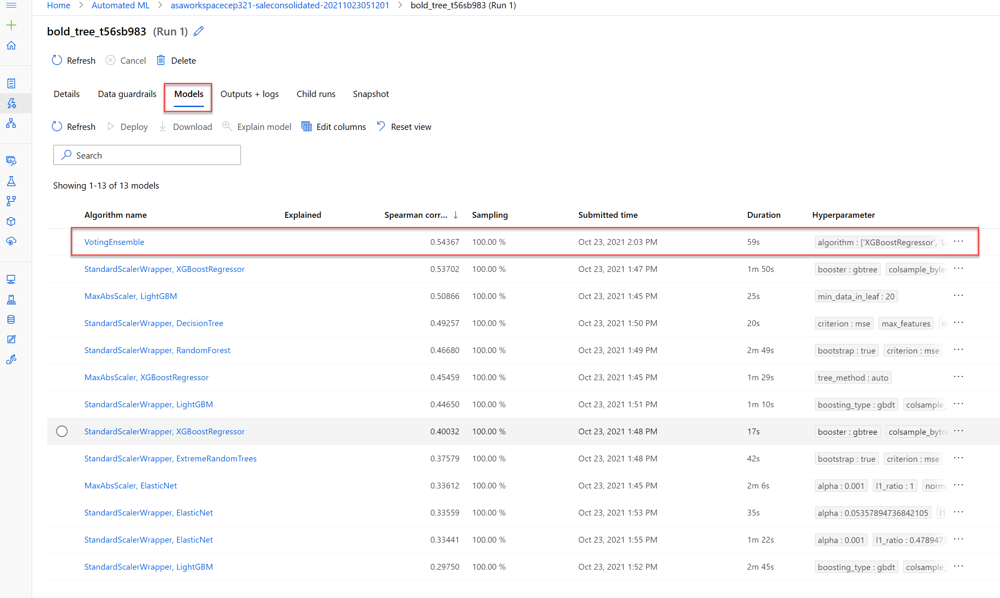

### Task 6: Enrich data in a SQL pool table using a trained model from Azure Machine Learning

In **SQLPool01**, there exists a table named **wwi_mcw.ProductQuantityForecast**. This table holds a handful of rows of data on which WWI would like to make product forecast predictions. We will leverage the machine learning model that was trained and registered from the Automated Machine Learning experiment to enrich this data with a forecasted prediction value.

1. In Synapse Studio, investigate the **wwi_mcw.ProductQuantityForecast** table by selecting the **Data** hub from the left menu. On the **Workspace** tab, expand the **Databases**, **SQLPool01**, and **Tables** nodes. Engage the actions menu next to the **wwi_mcw.ProductQuantityForecast** table, and select **New SQL script**, then **Select TOP 100 rows**.

    

2. Review the data in the table. The columns are:

    | Column | Description |
    |--------|-------------|
    | ProductId | The identifier of the product for which we want to forecast quantity. |
    | TransactionDate | The future date for which we want to predict. |
    | Hour | The hour of the future date for which we want to predict. |
    | TotalQuantity | The value of the prediction of quantity of the product for the specified product, date, and hour. |

3. Note the predicted **Total Quantity** value is 0. We will leverage our trained regression model to populate this value.

    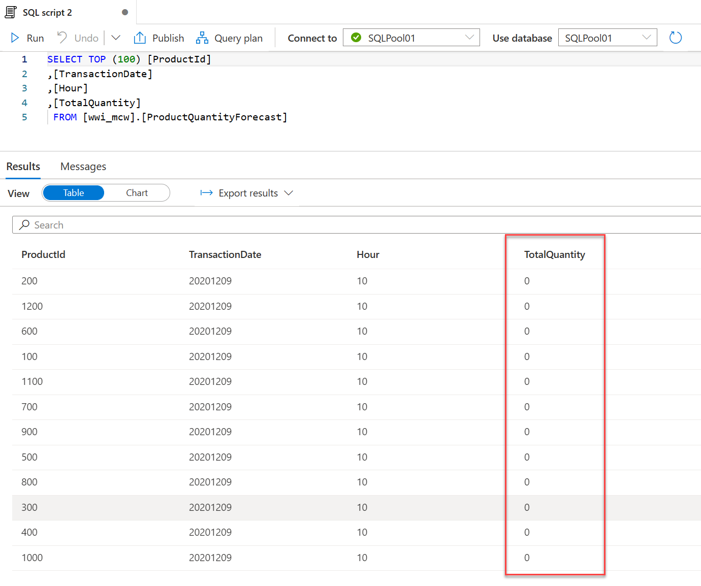

4. Expand the actions menu next to the **wwi_mcw.ProductQuantityForecast** table, this time select **Machine Learning**, then **Predict with a model**.

   

5. On the **Predict with a model** blade, ensure the proper Azure Machine Learning workspace is selected (amlworkspace{SUFFIX}). The best model from our experiment run is listed in the table. Choose the model, then select **Continue**.

    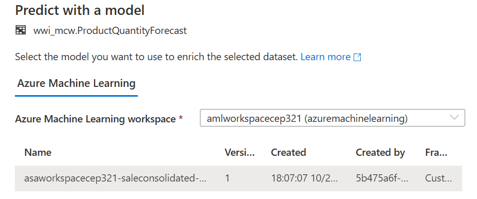

6. The Input and Output mapping displays, because the column names from the target table and the table used for model training match, you can leave all mappings as suggested by default. Select **Continue** to advance.

    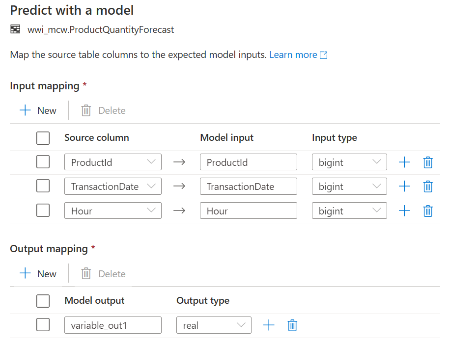

7. The final step presents you with options to name the stored procedure that will perform the predictions and the table that will store the serialized form of your model. Provide the following values, then select **Deploy model + open script**.

    | Field | Value |
    |-------|-------|
    | Stored procedure name | Enter `[wwi_mcw].[ForecastProductQuantity]`. |
    | Select target table | Select **Create new**. |
    | New table | Enter `[wwi_mcw].[Model]` |

    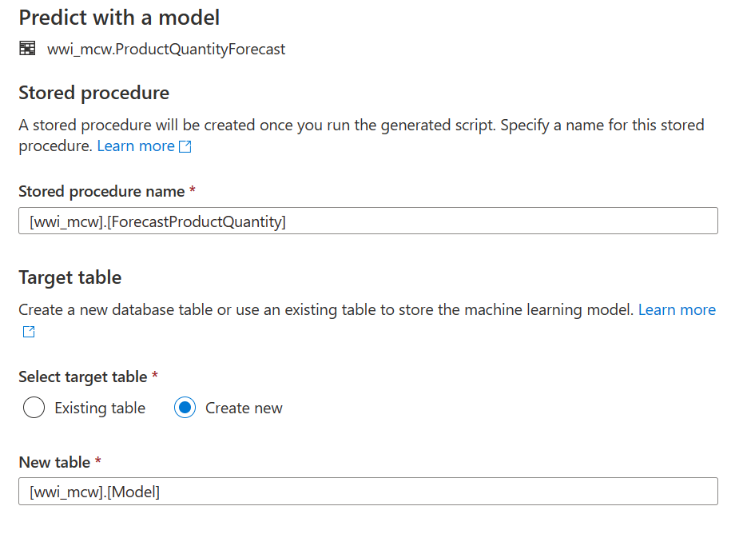

8. The T-SQL code that is generated will only return the results of the prediction, without actually saving them. To save the results of the prediction directly into the [wwi_mcw].[ProductQuantityForecast] table, replace the generated code with the following, be sure to replace `<your_model_id>` with the name of the best model you copied to a text editor earlier.

    ```SQL
    CREATE PROCEDURE wwi_mcw.ForecastProductQuantity
    AS
    BEGIN

    SELECT
        CAST([ProductId] AS [bigint]) AS [ProductId],
        CAST([TransactionDate] AS [bigint]) AS [TransactionDate],
        CAST([Hour] AS [bigint]) AS [Hour]
    INTO [wwi_mcw].[#ProductQuantityForecast]
    FROM [wwi_mcw].[ProductQuantityForecast];

    SELECT *
    INTO [wwi_mcw].[#Pred]
    FROM PREDICT (MODEL = (SELECT [model] FROM [wwi_mcw].[Model] WHERE [ID] = '<your_model_id>'),
                DATA = [wwi_mcw].[#ProductQuantityForecast],
                RUNTIME = ONNX) WITH ([variable_out1] [real])

    MERGE [wwi_mcw].[ProductQuantityForecast] AS target  
                USING (select * from [wwi_mcw].[#Pred]) AS source (TotalQuantity, ProductId, TransactionDate, Hour)  
            ON (target.ProductId = source.ProductId and target.TransactionDate = source.TransactionDate and target.Hour = source.Hour)  
                WHEN MATCHED THEN
                    UPDATE SET target.TotalQuantity = CAST(source.TotalQuantity AS [bigint]);
    END
    GO
    ```

9. You are now ready to perform the forecast on the TotalQuantity column. Open a new SQL script and run the following statement.

    ```SQL
    EXEC
    wwi_mcw.ForecastProductQuantity

    SELECT  
        *
    FROM
        wwi_mcw.ProductQuantityForecast
    ```

10. Notice how the **TotalQuantity** values for each row are now populated with a prediction from the model.

    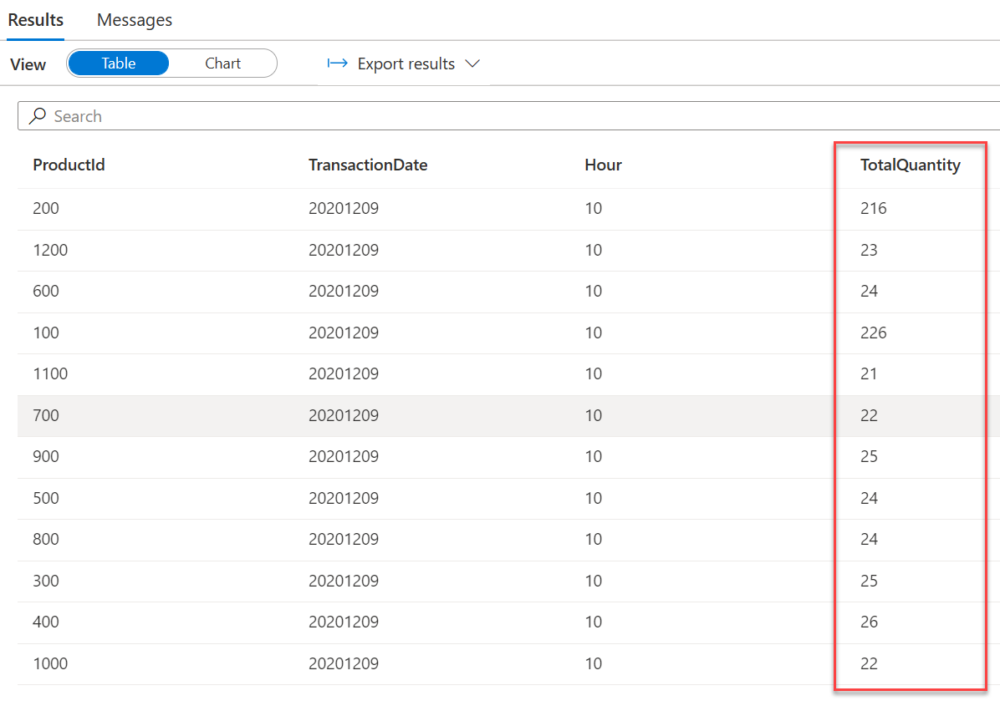


